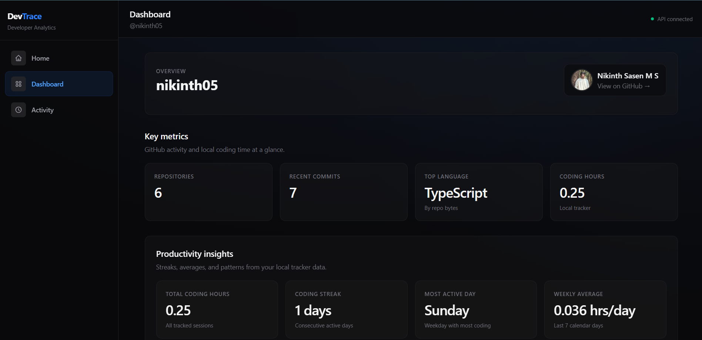

# DevTrace — Developer Analytics Dashboard

A full-stack developer analytics platform that integrates with GitHub, tracks local coding activity, and visualizes productivity insights.



> **Note:** Add your own screenshots to `docs/screenshots/` before publishing.

---

# Live Demo

https://dev-trace-eight.vercel.app/

---

## Features

- **GitHub analytics** — profile, repositories, commits, and language distribution
- **Interactive dashboard** — stat cards and Recharts visualizations
- **Local activity tracker** — Node.js script that records coding time
- **Productivity insights** — streak, weekly average, most active day (rule-based, no ML)
- **MongoDB persistence** — activity data stored in Atlas
- **Production-ready** — env-based config, CORS, deployable to Vercel + Render

---

## Tech Stack

| Layer | Technologies |
| ----- | ------------ |
| Frontend | React, Vite, Tailwind CSS, Recharts, Axios |
| Backend | Node.js, Express.js |
| Database | MongoDB, Mongoose |
| APIs | GitHub REST API |
| Deploy | Vercel (client), Render (server) |

---

## Project Structure

```
devtrace/
├── client/          # React frontend (Vite)
│   └── src/
│       ├── components/
│       ├── pages/
│       ├── charts/
│       ├── hooks/
│       └── services/
├── server/          # Express REST API
│   ├── controllers/
│       ├── routes/
│       ├── models/
│       ├── middleware/
│       └── utils/
├── tracker/         # Local coding time script
└── README.md
```

---

## Screenshots

| Home | Dashboard | Activity |
| ---- | --------- | -------- |
| `./docs/screenshots/HOME.png` | `./docs/screenshots/Dashboard.png` | `./docs/screenshots/Activity.png` |

---

## Local Setup

### Prerequisites

- Node.js 18+
- MongoDB Atlas account (or local MongoDB)
- GitHub account (optional token for higher API limits)

### 1. Clone and install

```bash
git clone https://github.com/YOUR_USERNAME/devtrace.git
cd devtrace

cd server && npm install
cd ../client && npm install
cd ../tracker && npm install
```

### 2. Backend environment

```bash
cd server
cp .env.example .env
```

Edit `server/.env`:

```env
PORT=5001
NODE_ENV=development
MONGODB_URI=mongodb+srv://<user>:<pass>@cluster.mongodb.net/devtrace
GITHUB_TOKEN=          # optional
CLIENT_URL=http://localhost:5173
```

Start the API:

```bash
npm run dev
```

### 3. Frontend

```bash
cd client
npm run dev
```

Open [http://localhost:5173](http://localhost:5173). The Vite dev server proxies `/api` to your backend.

Optional `client/.env` for custom proxy target:

```env
VITE_API_PROXY_TARGET=http://localhost:5001
```

### 4. Activity tracker (optional)

```bash
cd tracker
cp .env.example .env
# TRACKER_USERNAME must match the username used on the dashboard
npm start
```

---

## Environment Variables

### Server (`server/.env`)

| Variable | Required | Description |
| -------- | -------- | ----------- |
| `PORT` | No | Server port (Render sets automatically) |
| `MONGODB_URI` | Yes | MongoDB connection string |
| `CLIENT_URL` | Prod | Frontend URL(s) for CORS (comma-separated) |
| `GITHUB_TOKEN` | No | GitHub PAT for 5000 req/hr limit |
| `NODE_ENV` | No | `development` or `production` |

### Client (`client/.env` — production only)

| Variable | Required | Description |
| -------- | -------- | ----------- |
| `VITE_API_URL` | Prod | Render backend URL, e.g. `https://devtrace-api.onrender.com` |

### Tracker (`tracker/.env`)

| Variable | Required | Description |
| -------- | -------- | ----------- |
| `TRACKER_USERNAME` | Yes | Username stored in MongoDB |
| `API_URL` | No | Default `http://localhost:5001/api/activity/track` |
| `INTERVAL_MS` | No | Default `60000` |
| `CODING_SECONDS` | No | Seconds sent per interval (default `60`) |

---

## API Routes

| Method | Endpoint | Description |
| ------ | -------- | ----------- |
| GET | `/api/health` | Health check |
| GET | `/api/github/user/:username` | GitHub profile |
| GET | `/api/github/repos/:username` | Repositories |
| GET | `/api/github/commits/:username` | Commits + chart data |
| GET | `/api/github/languages/:username` | Language breakdown |
| POST | `/api/activity/track` | Record coding time |
| GET | `/api/activity/:username` | Activity + weekly stats |
| GET | `/api/insights/:username` | Productivity insights |

---

## Deployment

### Backend — Render

1. Create a **Web Service** connected to your repo.
2. **Root directory:** `server`
3. **Build command:** `npm install`
4. **Start command:** `npm start`
5. Set environment variables:
   - `MONGODB_URI`
   - `CLIENT_URL` = your Vercel URL (e.g. `https://devtrace.vercel.app`)
   - `NODE_ENV` = `production`
   - `GITHUB_TOKEN` (optional)

### Frontend — Vercel

1. Import the repo; set **Root directory** to `client`.
2. **Build command:** `npm run build`
3. **Output directory:** `dist`
4. Environment variable:
   - `VITE_API_URL` = your Render URL (no `/api` suffix)

`vercel.json` is included for SPA routing.

### Tracker (local machine)

Point `API_URL` in `tracker/.env` to production:

```env
API_URL=https://your-api.onrender.com/api/activity/track
TRACKER_USERNAME=yourname
```

---

## Scripts

| Location | Command | Purpose |
| -------- | ------- | ------- |
| `server/` | `npm run dev` | API with nodemon |
| `server/` | `npm start` | Production API |
| `client/` | `npm run dev` | Vite dev server |
| `client/` | `npm run build` | Production build |
| `tracker/` | `npm start` | Run activity tracker |

---

## Future Improvements

- JWT authentication and user accounts
- GitHub OAuth login
- Real IDE/window focus detection in tracker
- Email weekly summary reports
- Export analytics as PDF/CSV

---

## License

MIT
